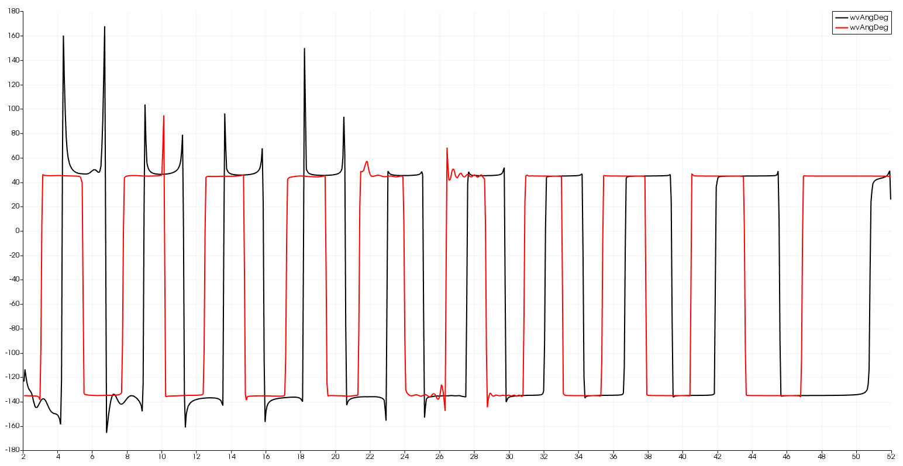

## Vertical velocity angular

1. [Wave-angle [2020-07-03]](#log_bsnqM_v0004_1)

### Attempting
- Calculate velocities along the depth for angular waves
- Try and avoid calculation of 'w' velocity. We already avoided need for pressure

### List of Work
- [x] Calculate local wave-angle. _locWvAng()_

-----------------------------------------------

### Wave-angle [2020-07-03]

#### Method-Vel [mostly wrong]
- The convectional expression for wave angle is using wave-elevation.   tan( &theta; ) = (d&eta;/dy) / (d&eta;/dx) as given in Sorenson (2004) while describing roller-breaker.
- But instad of calculating the derivatives I am relying on depth-integ vel P Q and hoping the results tan( &theta; ) = Q / P will be alright
- Calculated if the velMag .gt. 1d-10

#### Method-Eta [mostly wrong]
- The convectional expression for wave angle is using wave-elevation.   tan( &theta; ) = (d&eta;/dy) / (d&eta;/dx) as given in Sorenson (2004) while describing roller-breaker.
- Calculated using MLS shape function.
- No visible effect on run-time.

#### Results

| |
| :-------------: |
| **Figure :** Wave-Angle calculated using Vel vs calculated using Eta |
|  |
| **Figure :** Wave-Angle calculated using Vel vs calculated using Eta along centre-line of the domain |
|  |
| **Figure :** Wave-Angle calculated using Vel vs calculated using Eta along centre-line of the domain at t = 20s|
|  |

The observations are :

- The local instantaneous wave angle from Vel and Eta have a phase difference of 90deg for the uni-directional wave, before the collision with the wall.
- After the collision with the wall the returning wave super-imposing on the forward wave give similar wave angle as calculated using Vel and Eta.
- Method-Vel is more noisy and sensitive.
- The &Eta; wave elevation is anyways smoother than velocity, and additionally the MLS derivative ensures its more smooth.
- Method-Eta is mentioned in a paper, hence it may be correct, but neither seem very useful for the particle velocity calculations!
- Keeping the Method-Eta and commenting out the Method-Vel.

-----------------------------------------------