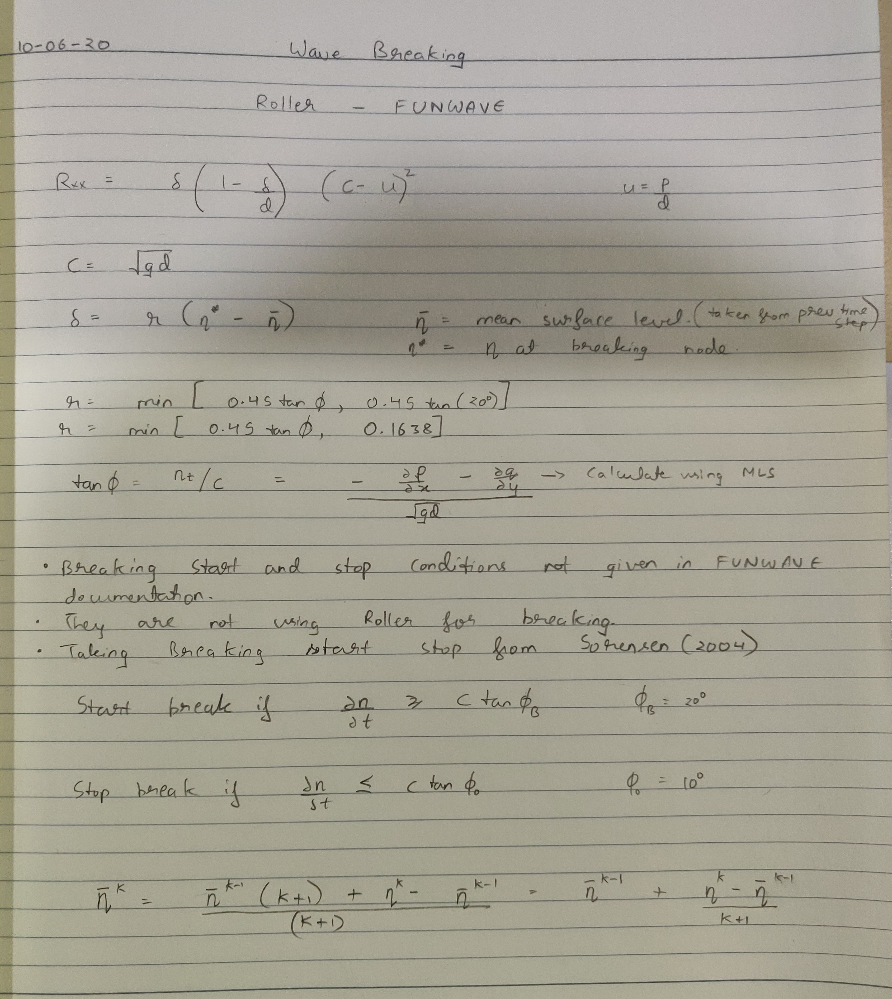
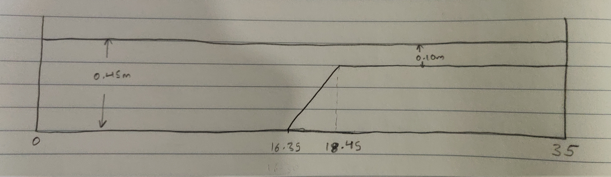
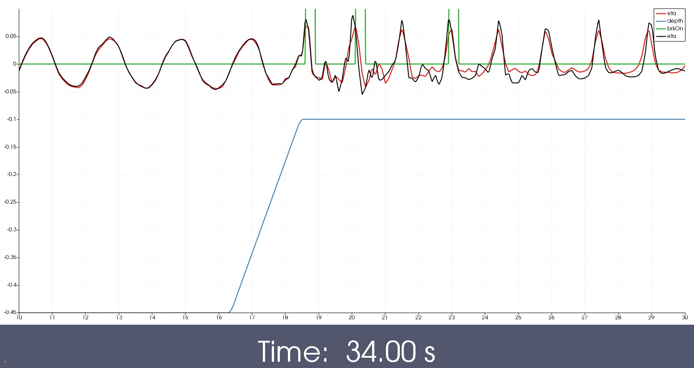
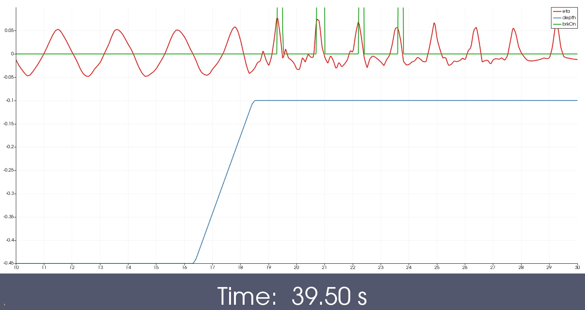

## Wave breaking

1. [Roller1 X only [2020-06-10]](#log_bsnqM_v0004_1)

### Attempting
- Implement wave-breaking algorithm

### List of Work
- [ ] Roller - FUNWAVE
	- [x] X only
- [ ] Kennedy - FUNWAVE
- [ ] Roller - Sorenson
- [ ] Kennedy - Original

-----------------------------------------------

### Roller1 X only [2020-06-10]
- FUNWAVE documentation for wave breaking is at this [link](https://fengyanshi.github.io/build/html/wavebreaking.html)
- They have used and implemented Kennedy (2000) appraoch for wave breaking.
- However they have also presented here a roller scheme, to be used for sediment transport and not for wave breaking.
- However their approximate roller approach removes a few complications from the Sorenson (2004) roller appraoch.
	- No need to track the foot of the bore
	- Calculation of roller thickness &delta; is very simple
	- Calculation of tan&Phi; (tangent at roller toe point) is simpler
	- Overall everything is only point based hence should be easy to implement
	- d&eta;/dt is calculatued using the continuity equation. Given that now we can accurately calculate derivatives at any point using MLS, this too is easy.

The formulation implemented is presented below.
	
- FUNWAVE has not given the start and stop conditions for breaking.
- The idea for these start and stop conditions are to only do dissipation on the face of the wave (where the plunging or spilling will happen)
- So we have picked the start and stop conditions from Sorenson (2004)
- But we have not implemented the change in the stop condition based on the age of the roller
- We simply do, start if > c tan&Phi;b, stop if < c tan&Phi;0
- Also avg(&eta;) here is taken to be average of eta since the beginning of the simulation. It is not reset at regular intervals.
- The below algorithm was implemented in _dynaMatrices_
- Currently the dissipation term is only calculated along X and is only implemented to P (depth integrated vel along X) equation.

#### Results - 1
The above algorithm was implemented for a simple case shown below. 
 
This case is presented in Fang (2017), however we did not run for validation for now.

The tested wave is :  
H=0.095m, T=1.25s, d=0.45m. 
L = 2.122m, kh = 1.332  

Mesh 1 casename : brk2   
Coarse grid of 35 x 2, &Delta;x = 0.1m (linear), &Delta;x = 0.05m (quad), &Delta;t = 0.02s

| |
| :-------------: |
| **Lines :** Wave elevation. With roller (red). Without roller (black). Breaking on (green). Depth (blue) |
| **Figure :** GIF showing the wave passing over the shoal with and without roller applied |
|  |
| **Figure :** Snapshot at T = 34.0s |
|  |
| **Figure :** Snapshot at T = 39.5s |
|  |
| **Figure :** GIF of contour of eta, depth, and breakingOn |
|  |

Observations:

- The code without roller (black) failes after 35.5s due to the wave breaking. The code with roller (red) keeps running for full 40s.
- There is a dissipation of wave due to the roller clear from comparing the red (roller) and black (no roller) lines.
- The breaking is turned on correctly only on the face of the wave where the slope of the wave is too high.
- Need to run a fine mesh because the wave become very short in the breaking reagion due to shoaling and would need better resolution to capture. This may improve the breaking too.
- Lots of noise introduced in the tank as seen through eta contour after the breaking. This may be improved with finer mesh, dissipation terms in Y, XY cross dissipation terms, and turbulence implementation.
- **This however confirms that failures of instability in the old code (prior 2019) was all due to the inherent instabiliyt of the code**. Now that the code is stable, the wave breaking implementation too seems to be stable.
- **Note that this implementation was highly approximated**. Will implement Kennedy (2000) properly later.

-----------------------------------------------

## References
1. Sørensen, O. R., Schäffer, H. A., & Sørensen, L. S. (2004). Boussinesq-type modelling using an unstructured finite element technique. Coastal Engineering, 50(4), 181–198. https://doi.org/10.1016/j.coastaleng.2003.10.005

1. Kennedy, A. B., Chen, Q., Kirby, J. T., & Dalrymple, R. A. (2000). Boussinesq Modeling of Wave Transformation, Breaking, and Runup. I: 1D. Journal of Waterway, Port, Coastal, and Ocean Engineering, 126(1), 39–47. https://doi.org/10.1061/(ASCE)0733-950X(2000)126:1(39)

1. Fang, K., He, D., Liu, Z., & Sun, J. (2017). Numerical simulation of wave motion over fringing reefs using a shock-capturing Boussinesq model. Twenty-Seventh (2017) International Ocean and Polar Engineering Conference, 399–405.