## Common algorithm developments in the code

1. [Paralution solver FORTRAN plugin [2020-10-15]](#log_bsnqM_vAlgo_1)
2. [Test pressure term with integration by parts [2021-02-28]](#log_bsnqM_vAlgo_2)
3. [Stokes2 wave input added [2021-04-06]](#log_bsnqM_vAlgo_3)
4. [Wave input - Wheeler stretching [2021-04-28]](#log_bsnqM_vAlgo_4)

### Attempting
- From 2020-Dec-01 onwards, the common algorithm developments will be noted in this document.
- This log file should only be updated for a branch if the algorithm has been implemented in that branch.

### List of Work
- [x] Test pressure term with integration by parts [Link](#log_bsnqM_vAlgo_2)
- [x] Added _fem_dN6iSc6dx_N6j()_ femAnalyticalTri_v1.1.f90
- [ ] waveFileModule search to binary instead of sequential
- [x] waveFileModule time-series interpolated by cubic spline instead of linear. Verified implementation. [2021-04-05]
	- Check the importance of this for shipMod. May not matter in this though [link](./log_bsnqM_v0002.md#log_bsnqM_v0002_13)
- [x] Stokes2 wave input in 'modsInletBC.f90' [2021-04-06] [link](#log_bsnqM_vAlgo_3)

-----------------------------------------------

### Wave input - Wheeler stretching [2021-04-28]

- The wheeler stretching linearly stretches the z axis from [-h, &eta;] to [-h, 0].
- It is for sure to be applied for Airy theory. 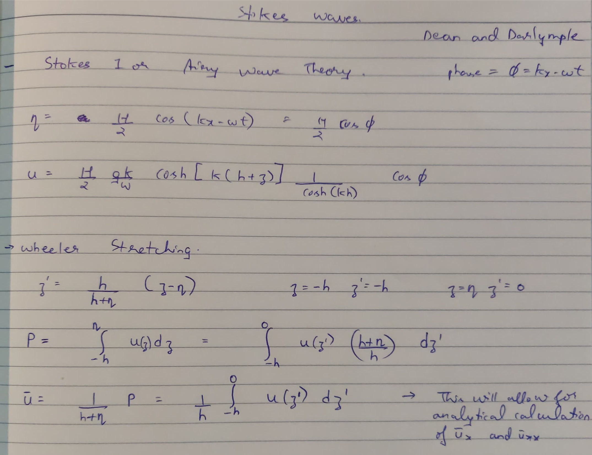
- Earlier I had only integrated the normal velocity expression from [-h, 0] and given in the wave input for Airy case thinking it doesnt matter much. Now I have applied wheeler stretching and hence multiplied the [-h, 0] integrated expression with (h+&eta;)/h as seen from the equation above.

#### Stokes2 and higher
- In stokes derivation, the FS BC about z=&eta; is expanded using Taylor series about z=0.
- It is explained surprisingly well in thus Wikipedia article [link](https://en.wikipedia.org/wiki/Stokes_wave)  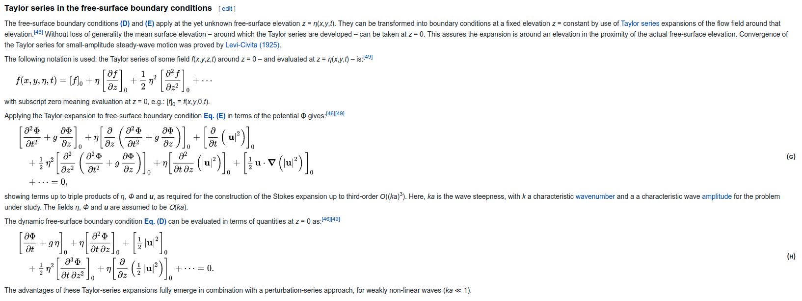
- The same is also seen in the Dean and Darlymple book. 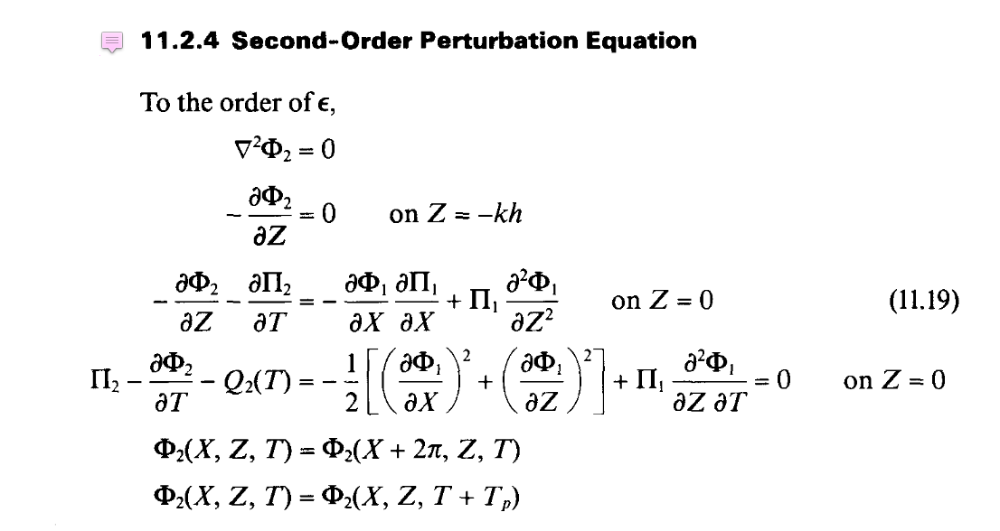
- Dr. Yan says "My understanding is that Linear theory definitely need stretching and the Stokes 5th does not need.  I did not look at the Stokes 2nd and 3Rd.  You can compare Stokes 2nd and 3Rd theory with linear for the free surface velocity to find out the answer."
- Sriram sir says "Yes, use stokes 5th order or Fenton 5th order with wheeler stretching. Shaswat has the code."
- Murali sir says that stretching is only needed for Airy.
- I think stretching is not needed for anything other than the Airy wave theory.
	- Therefore in the wave generation, I will edit the velocity calculation limiting to [-h, &eta;] instead of [-h, 0] which was done earlier.

-----------------------------------------------

### Stokes2 wave input added [2021-04-06]

- Corrected the implementation of airy wave input by changing the phase (kx - wt) to cos and adding a (kx - wt + phi0) to start from eta=0 followed by a crest
	- **Note that the phase moves backward w.r.t time t in (kx - wt + phi0), therefore for eta=0 followed by a creast in cosine, phi=90deg and not phi = 270deg**
- Now there is no longer a need for the -ve sign of the wave height in the user input.

Additionally Dean and Darlymple book had the expression for eta and u which I coded into _stokes2WaveModule_. Subsequently added the function _initStokes2File()_ to _waveFileModule_. A option for Stokes2 has been added in the user input .inp file, with option '2' for Stokes2

The expression for eta from Dean and Darlymple book is as below. 
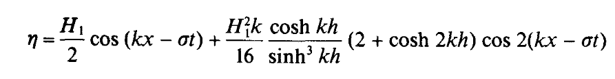

This expression cannot be simple converted to a sine expression to make it start from eta=0 at t=0. One cannot simply write `A cos(th) + B cos(2th)` as `A sin(th) + B sin(2th)`  
Therefore we add phi0 to the phase, (kx - wt + phi0). 
This phi0 has to be evaluated as follows. At (kx-wt)=0, eta = 0. Hence 
 
Here the larger solution with + sign obtained gives us the required phi0 to start the solution for eta = 0 at t=0. 
Note that for stokes2 the vel at this eta=0 will not be zero but that's alright. Its a small mismatch is velocity only for the 1 initial time-step.

Note the shape of first order and second order components as given in Dean and Darlymple book is  
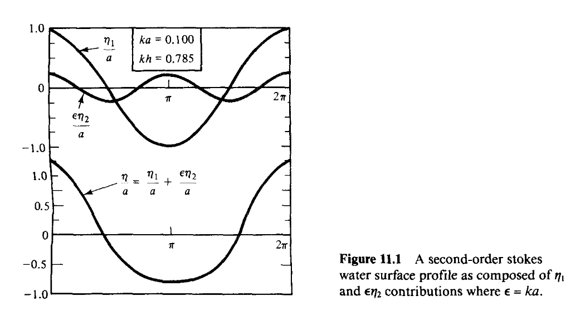

The comparison of first and second order stokes wave in Sundar book is 
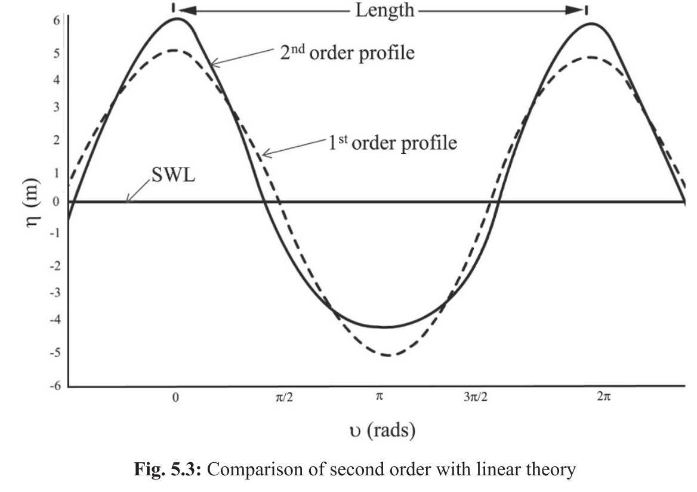

The comparison that we get is similar. Measured at inlet. H=0.022m T=2.5s d=0.4m 
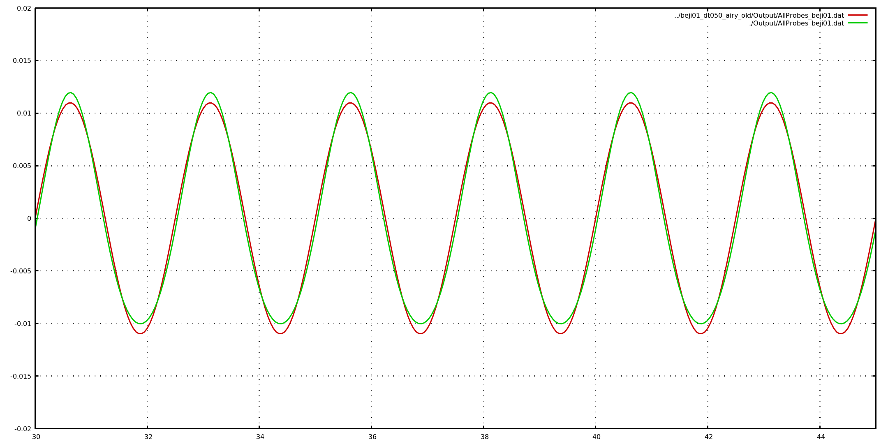 
**Fig: eta** 
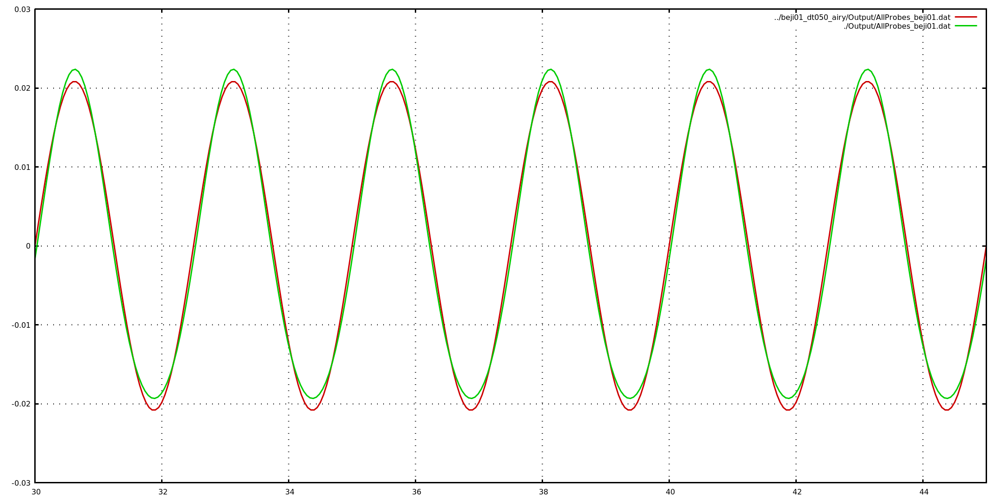 
**Fig: velP**

All results in "Test_beji/Airy_vs_Stokes2"

-----------------------------------------------

### Test pressure term with integration by parts [2021-02-28]

- I had originally coded the pressure term without using integration by parts
	- i.e.   `\iint_\Omega \frac{d}{\rho} \frac{\partial P}{\partial x} \,d \Omega => \left[ \iint_\Omega \frac{1}{\rho} \phi_i d \frac{\partial \phi_j}{\partial x}  \right] P_i`
- However I was wondering if removing the differential from the pressure will make any difference. So I changed the code to the following form.
	- i.e.    `\iint_\Omega \frac{d}{\rho} \frac{\partial P}{\partial x} \,d \Omega => \left[ - \iint_\Omega \frac{1}{\rho} \frac{\partial (\phi_i d) }{\partial x} \phi_j + \int_\Gamma \frac{1}{\rho} \phi_i d \phi_j n_x \right] P_i`
- I tried this because we get a lower draft then the FUNWAVE results and we also get lower amplitude for some parts of the waves.
- However the results obtained in IITM-Bsnq for both forms were identical. Hence it did not make any difference.
- Retaining the original form without any boundary integrals in the final version.

The following examples are for a 36 x 6 ship in 5m water depth at 0.85 Froude number. 
**Here comparison is done between FUNWAVE-TVD 3.4 and IITM-Bsnq commit 'fe1e6ad'**

| |
| :-------------: |
| **Figure :** y=204 Centreline |
| 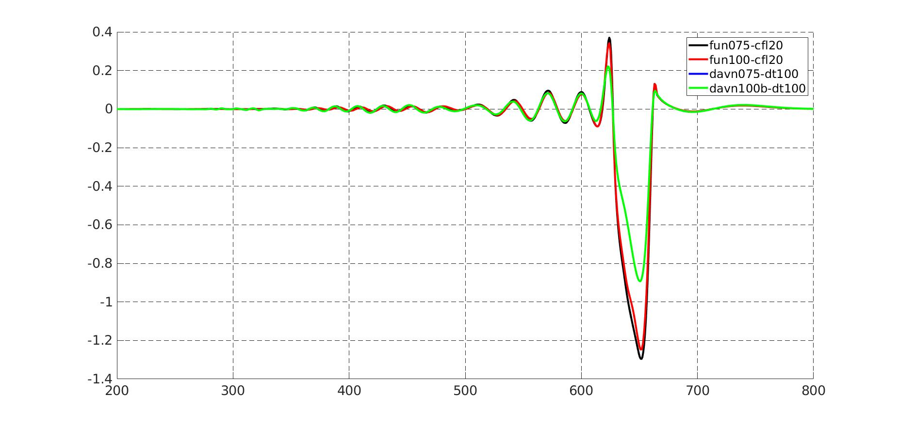 |
| **Figure :** y=207 0.50 x shipWidth |
| 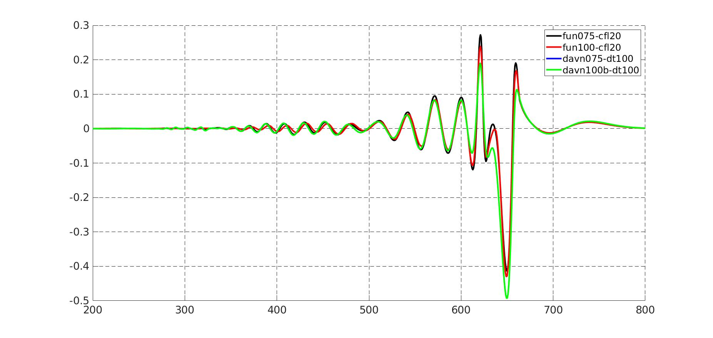 |
| **Figure :** y=219 2.50 x shipWidth |
| 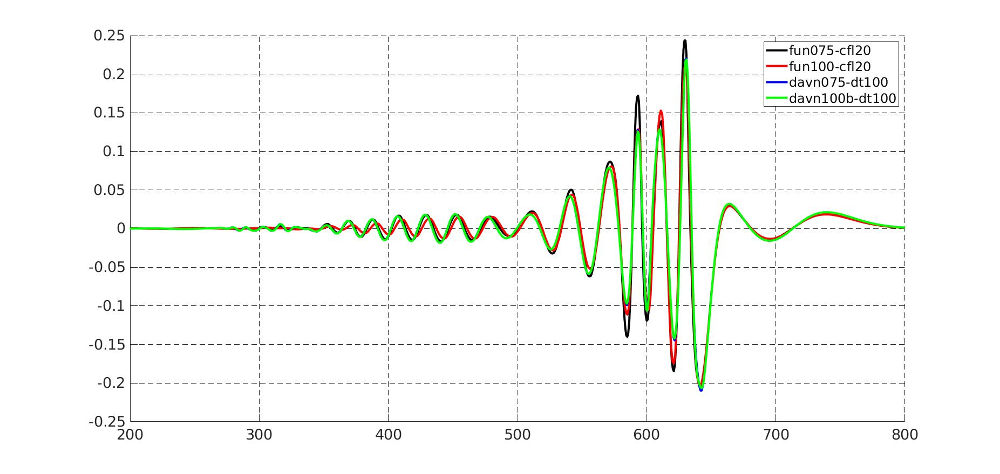 |
| **Figure :** y=231 4.50 x shipWidth |
| 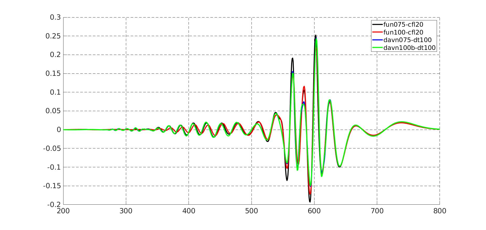 |

-----------------------------------------------

### Paralution solver FORTRAN plugin [2020-10-15]
- The existing system of using the paralution solver in FORTRAN was provided by them itself and was robust and simple.
- Paralution was written in C++
- Our code is in FROTRAN
- The coupling between FORTRAN and C++ was limited to using common datatypes.
- The way the existing code was written, every-time we called _paralution_fortran_solve_csr()_ subroutine in FORTRAN, it would do the following
	1. Create a copy of all the A, X, B in C++
	2. Initialise a C++ solver object 
		1. Solver type
		2. Solver tolerance limits and other setting
		3. Save the large A matrix into the solver object (Very slow process)
		4. Save the B and X0 in the solver object
	3. Solve using the settings provided by the user
	4. Copy the solved X from C++ object to the FORTRAN memory
	5. Delete the C++ object.
- The above process happens at each call, which is 12 times per time-step
- In Bsnq the A matrix never changes. Also the solver setting never change. 
- Only B and X0 change
- So the time taken in Steps 1-2 is useless.
- Ideally we would like to create the solver object one time at the beginning of the simulation and save the A matrix into the solver. After that only update B and run the solver to get the solution.
- However the big problem is that the solver is a C++ object and hence cannot be "saved" as a FORTRAN object.
- In the existing code the scope of the solver object is limited to _paralution_fortran_solve_csr()_ function, and as soon as it finishes execution the object space will be deleted and will have to be re-initialised.
- **So the challenge was to figure out how to create and save a C++ object from the FORTRAN code**
- This is where the magic of **void** pointer in C++ comes into picture. **This is the greatest feature of a programming language I have ever seen**. Refer to this [link](https://community.intel.com/t5/Intel-Fortran-Compiler/Calling-C-cpp-objects-from-a-Fortran-subroutine/td-p/1110556)

#### Modifications to the solver code
- I have moved the plugin code from the general location (where paralution is installed) to the subroutines folder instead.
- The file name is still the same _paralution_fortran.cpp_. This way one can switch to the old generic plugin just by changing the makefile
- The modification are quite intensive and difficult to follow.
- To understand the implementation, first refer to the code in 'OtherCode/bind-fortran-cpp'. Looking directly at the modifications in the Bsnq code may be very confusing
- This is how the process works for each.
	1. Create the desired class in C++.
	2. Create a _void_ pointer in C++.
	3. Create a function in C++ which will be called from FORTRAN. 
		- This function will create the solver object in C++ and return a void pointer pointing to this object. 
		- As pointer type is common between C++ and FORTRAN, as long as this pointer is alive the object that it is pointing to will be alive.
		- This way we can create a C++ object and point to it using FORTRAN pointer
		- The interesting thing to note is that pointers are generally of the datatype at which they are pointing
		- However void pointer is special as it can point to any datatype and hence it can point to object of any class. (beautiful feature)
	4. Now create function in C++ which can be called from FORTRAN. 
		- Pass the void pointer from FORTRAN in these functions to refer to a specific object along with the other variables. 
		- And then use the normal C++ code to call the function associate with that object with the respective variable in C++ itself.
- Its a very complex process but it works well

The new solution process in bsnq code is as below
	- The process is now modified where a solver object is create for W, Eta and PQ equations each.
	- During the creation the solver setting are fixed to BiCGStab
	- Error norm is fixed to L2 norm
	- All tolerences are set once in the beginning
	- The large A matrix is transferred to the solver only once in the beginning and after that it is never transferred again. This is where I think we gain the majority of the time in transferring A and allocating space for it. In old method this method happened at each call.
	- Space is create for X and B
	- Only X0 and B are updated every time-step and solver is just run (**not re-created every time**)

In the Boussinesq code modification are made to

1. subroutines/bsnqModule.f90
	- Creating the solver object for W, Eta and PQ equations separately
2. subroutines/bsnqModuleFncs.f90
	- Changed the solver calling lines. Old lines are commented to easily switch back to old reliable robust version if required.
3. subroutines/solver_v1.0.f90
	- New solver subroutine. _solveSys2()_
	- Old one is also there but is un-used _solveSys()_
4. subroutines/paralution_fortran.cpp
	- The new file with my custom plugin code.

Although I think this is the best piece of code I have ever written, it gave very limited gains in speed.

#### Speed gains
- Overall on normal i7-9th Gen system I got upto 1.08x
- However on Aqua server it hardly made any significant difference.

-----------------------------------------------
