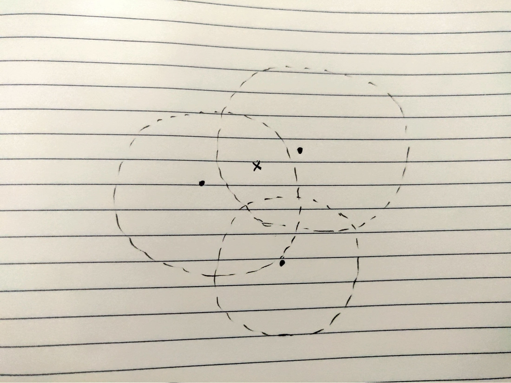
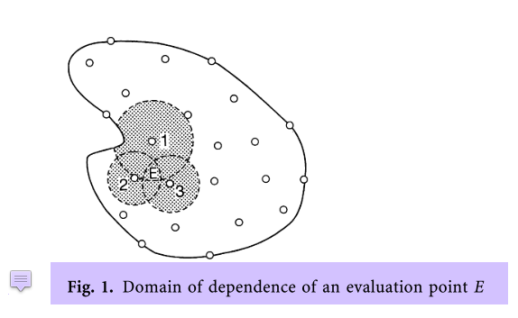
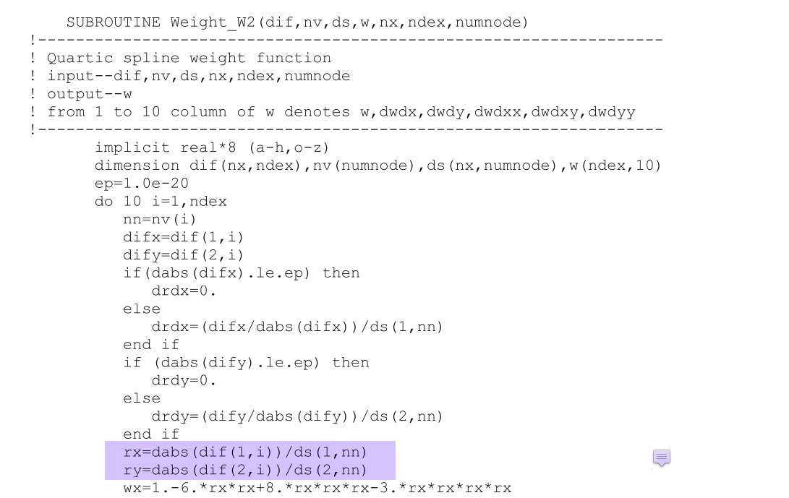

# Common bugs in the code

1. [_updateSoln()_ failing in Aqua cluster [2020-09-09]](#log_bsnqM_vBugs_1)
2. [Changing from RIAV = R(NOD) to RIAV = (R(NOD) + R(NEI))/2 [2021-09-29]](#log_bsnqM_vBugs_2)

## Attempting
- From 2020-Sep-09 onwards, the bugs in the main code common across all branches will be noted here.
- This log file should only be updated for a branch if the bug-fix has been done in that branch.

## List of Work

-----------------------------------------------

## Changing from RIAV = R(NOD) to RIAV = (R(NOD) + R(NEI))/2 [2021-09-29]

See MLPGR log (#log_mlpgrv01_vBugs_3) for the detailed explanation.

- I had made a mistake in understanding the support domain.
- Support domain is actually influence domain
- The spherical (assumed) influence domain of the node is the spherical region around the node where its value will have a influence
- Let say you have a point 'x' where you need to interpolate as shown in the following figure. 
- The dots are the nodes at which you have information.
- The circles are the support (influence) domain of the dots.
- The domain of dependence of 'x' will actually then be a combination of these circles. Ref. Mukherjee (1997)   
- This is true for all particle based methods such as MLS, RPIM, where the value at a position 'x' are obtained using known values at the 'dots'.
- If you check the GR Liu book for the MLS code, it is clearly seen using the radius of each 'dot' neighbour and not a radius for 'x'.  
- Therefore in all places where we do interpolation, I have changed it to RIAV = R(NEI).
- Some additional things were done in the MLPGR code, for which please refer to (#log_mlpgrv01_vBugs_3).

### List of places where edit was made

| SN  | File | Function | Description |
| --- | ---- | -------- | ----------- |
| 1 | modsMFree.f90 | mls2DDx | Changed to rj = r(nei) in two places within this function.   Also modified _weightFnc()_ to decide the weights based on dr/rj>1 etc. |
| 2 | modsMFree.f90 | testMls2DDx | Modified according to mls2DDx changes. |
| 3 | bsnqModuleFncs2.f90 | setMFree | Major changes in the influence domain radius calculation   1. Find the radius for vertices (lin node) using the farthest point in the linktable.   2. Find the radius for the edge-centres (quad nodes) using the radius of the lin nodes.   (This was necessary coz the radius for quad nodes based on farthest point in linktable would yield a very different radius compared to the lin nodes within that triangle) |
| 4 | findNeiFromLinkList.f90 | findNeiLinkList | Within this function alone I am using (rad) as a domain of dependence for the particular node.   Here rad is used a control for the neighbour search using linktable. The control condition is that if any neighbour point has distance smaller than rad then loop again. It should be alright as I am still going quite far out in the neighbour search. |
| 5 | shipMod.f90 | calcDrag | Shifted to r(nei) form. |

Verified the implementation using gradEta compared for a ship wake case with irregular mesh against the same obtained from Paraview directly.   The ship calcDrag was verified by comparing against previous results for two ships moving one behind the other.

-----------------------------------------------

## _updateSoln()_ failing in Aqua cluster [2020-09-09] [2020-09-09]
- While running the Boussinesq code in IITM's new Aqua cluster, I sometimes got segmentation fault in the first step for RK$ for the first time-step itself.
- It was quite a random error. In one example the case ran fine for 0.1s time-step and then gave a segmentation fault the exact same case when I ran with 0.05s time-step.
- On checking I found that the segmentation fault came from _updateSoln()_ subroutine.
- On deeper check it was realised the error was from the following line in each of the select case.   `b%tOb(0)%e = b%tOb(1)%e + b%gXE/2d0`
	- On commenting this line the code runs without segmentation fault
	- This is completely random as the case runs absolutely fine in Aqua for some cases and fails for some other cases.
	- I check there is no issue with allocated memory or matrix size.
	- Infact the case which gives error in Aqua runs fine in my laptop or in VSR server.
- I believe its some weird issue with the SIMD code generated by ifort for that line. 
	- Its weird that there is no issue in any of the other line in this subroutines.
- I sorted this out by changing this to a loop and put OpenMP parallel.
- After this it ran fine in Aqua.
- It was confirmed through cases rect2D and inl2B that results are identical and run-time is not effected at all. (maybe very very marginally faster)

-----------------------------------------------