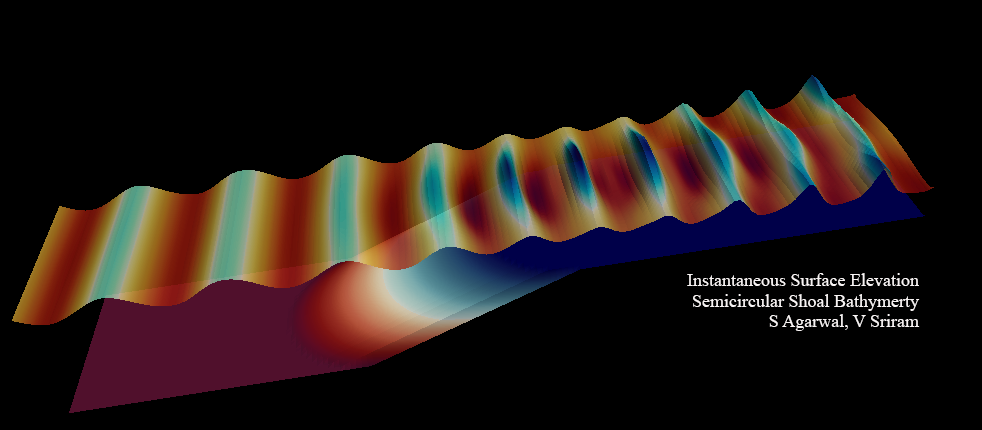

# FEM-Bsnq

**Details**  
A finite-element model based on weakly non-linear depth integrated form of Boussinesq equations as derived by Madsen. The FEM formulation is based on triangular elements with mixed linear and quadratic interpolation. The code is written in modern form FORTRAN, and will be checked to work with both Intel compilers and GNU compilers. The FEM domain and boundary integrals in this code are calculated analytically in Mathematica. The time-stepping in earlier version used to be 3-point explicit Adam Bashforth. However we will try and do predictor corrector time-stepping, hoping to improve the results for ship generated waves.  

This is a re-write of the code. It is done to create a modular code with object-oriented programming in mind. A module called *bsnqModule* will contain all required subroutines to be called by the user for FEM set-up and execution. A type (class) called *bsnqCase* will be used to make each case as an object. The required common variables are made global within the module and therefore will help reduce re-declaration in the subroutines within the module without clashing with the main program. This modular approach will be useful in coupling this code with our other codes and will hopefully make it easier for others to contibute too. Another important development is creating a general set of subrouines for calculating the FEM integrals as shown in femAnalyticalTri_v1.0.f90. This will slowly build up to a comprehensive list.  

Currently only the solver for system of linear equations is parallelised using OpenMP. However the code is being written such that it'll be possible to make it parallel based on our earlier experiences in the MLPG\_R code.

Please check the Trial xx - Logs with the markdown file for details regarding each version of the code and development stage.

##### Modular structure
- bsnqModule
  - type :: bsnqCase
    - procedure ::  initMat
    - procedure ::  meshRead
    - procedure ::  femInit
    - procedure ::  setRun
    - procedure ::  statMatrices
    - procedure ::  dynaMatrices
    - procedure ::  destructR1
  - type :: waveType
    - constructor :: waveLenCalc
- bsnqGlobVars  
  - Datatypes and constants only

