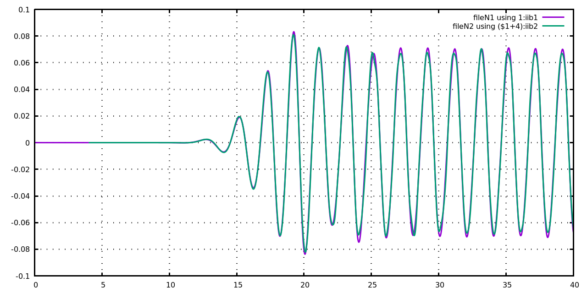

# Develpoment log for bsnqM

## Versions bsnqM v1.01

**Details**  
continued from bsnq\_par\_v8.36

- Quad Jacobian = Linear Jacobian for Triangle
- Analytical Integration
- Object Oriented Programming
- Modular Time-stepping formulation
  
1. [Initial Development log](./log_bsnqM_v0001.md)
1. [Moving pressure field and Gradient MLS development](./log_bsnqM_v0002.md)
1. [Vertical velocity calculation](#log_bsnqM_v0003)

-----------------------------------------------

<a name = 'log_bsnqM_v0003' />

## Vertical velocity calculation

### Attempting
- Calculate velocities along the depth 

### List of Work
- [x] Consecutive derivative based - uDx uDxx uDxxx 
- [x] Consecutive derivative based - pDx pDxx pDxxx 
- [x] Calculation of u, w and pr assuming unidirectional waves

### Observations : VertVel : Unidirectional wave [2020-03-13]
- With the derivatives confirmed I proceeded with calculation of the vertical velocity based on Dingemans (1994, pg. 390). 
- Regular waves of T=2s, H=1m, h=0.7m were generated in fnpt and the solution was transferred to Bsnq at 5m.
- A probe was placed at x=20m, z=-0.35m in both fnpt and Bsnq.
- In this reference the expression of u seems to be correct and was verified by comparing against fnpt.
- However the expression for w and pr is wrong.
- This mistake was verified by testing in Mathematica the results obtained from Dingemans (1994, pg. 390) expressions for Airy wave theory. Check the file 'VertVel_UnidirectionalWave/CheckFormulaUsingAiryWaveTheory.nb'.
- The correction for w was made using the continuity equation.
- The correction for pressure was made using the w momentum equaitons and considering only d(w)/dt = -grad(P)/rho + g, and taking only the first term in the corrected w expression for calculation of d(w)/dt.

  

**Fig :** The correction of equations given in Dingemans (1994).

  

**Fig :** Comparison of the results for velocity and pressure for Airy wave obtained from the Airy wave theory (u, w, pr) vs Dingemans (uc = uDing, wDing, prDing) and the corrected expressions (uc, wc prc)

  

**Fig :** Resuts from Bsnq (green) compared against FNPT (purple) for **Pressure, uVel, wVel** at x=20m, z=-0.35m, for a regular wave of T=2s, H=0.1m, d=0.7m, generated in FNPT2D using 2nd order wavemaker theory and transferred to Bsnq at x=5m.

### Observations : 3rd Derv consecutive derivative based [2020-03-06]
- Analytical function sin(x) was used to check till third derivative calculated using the MLS code.
- The consecutive derivative based approach is:
	- f'(x) = d ( f(x) )/ dx
	- f''(x) = d ( f'(x) )/ dx
	- f'''(x) = d ( f''(x) )/ dx  
- The subroutine is _calcDerv_, part of bsnqModule. It will only be called if the pObf is allocated by the subroutine _setMFree_, also a part of bsnqModule.
- From the results below it can be seen that near the boundaries the 2nd and 3rd derivatives are inaccurate. **This can be a issue in calculating depth resolved velociies for coupling near the boundaries.**

  

  

**Fig :** Results of 1st, 2nd and 3rd derivatives of sin(x) compared for MLS code against.

-----------------------------------------------

## References
1. Bosboom, Judith. 1995. “Boussinesq Modelling of Wave-Induced Particle Velocities.” TUDelft.

1. Dingemans, M. W. 1994. “Water Wave Propagation over Uneven Bottoms.” TUDelft.
