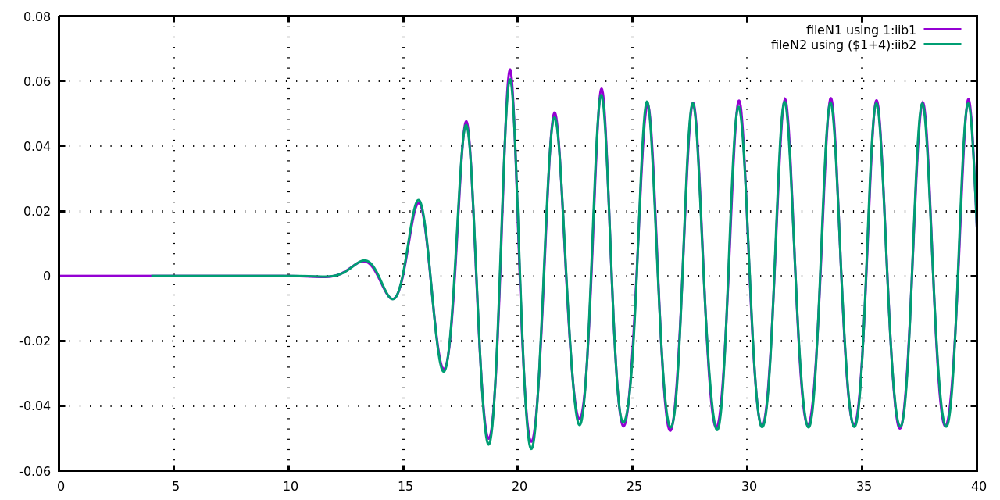

# Develpoment log for bsnqM

## Versions bsnqM v1.01

**Details**  
continued from bsnq\_par\_v8.36

- Quad Jacobian = Linear Jacobian for Triangle
- Analytical Integration
- Object Oriented Programming
- Modular Time-stepping formulation
  
1. [Initial Development log](./log_bsnqM_v0001.md)
1. [Moving pressure field and Gradient MLS development](./log_bsnqM_v0002.md)
1. [Vertical velocity calculation](#log_bsnqM_v0003)

-----------------------------------------------

<a name = 'log_bsnqM_v0003' />

## Vertical velocity calculation

### Attempting
- Calculate velocities along the depth 

### List of Work
- [x] Consecutive derivative based - uDx uDxx uDxxx 
- [x] Consecutive derivative based - pDx pDxx pDxxx 
- [x] Calculation of u, w and pr assuming unidirectional waves
- [ ] Calculation of u, w and pr for directional wave

### Observations : VertVel : Unidirectional wave [2020-03-13]
- With the derivatives confirmed I proceeded with calculation of the vertical velocity based on Dingemans (1994, pg. 390). 
- Regular waves of T=2s and 1.5s, H=1m, h=0.7m were generated in fnpt and the solution was transferred to Bsnq at 5m.
- Probes were placed at x=20m, z=-0.50m and z=-0.35m in both fnpt and Bsnq.
- In this reference the expression of u seems to be correct and was verified by comparing against fnpt.
- However the expression for w and pr is wrong.
- This mistake was verified by testing in Mathematica the results obtained from Dingemans (1994, pg. 390) expressions for Airy wave theory. Check the file 'VertVel_UnidirectionalWave/CheckFormulaUsingAiryWaveTheory.nb'.
- The correction for w was made using the continuity equation.
- The correction for pressure was made using the w momentum equaitons and considering only d(w)/dt = -grad(P)/rho + g, and taking only the first term in the corrected w expression for calculation of d(w)/dt.
- **From the tests for T=2.0s kh=0.5 we can see that the match is excellent for u, w, and pr. However the match is not very good for T=1.5s kh=1.4 for w and pr.**

| **Figure :** The correction of equations given in Dingemans (1994). |
| :-------------: |
|  |

| **Figure :** Comparison of the results for velocity and pressure for Airy wave obtained from the Airy wave theory (u, w, pr) vs Dingemans (uc = uDing, wDing, prDing) and the corrected expressions (uc, wc prc) |
| :-------------: |
|  |
|  |
|  |

##### Regular T=2.0s
| **Figure :** Resuts from Bsnq (green) compared against FNPT (purple) for <b>eta</b> at x=20m for a regular wave of T=2s, H=0.1m, d=0.7m, kh=0.95 generated in FNPT2D using 2nd order wavemaker theory and transferred to Bsnq at x=5m. |
| :-------------: |
|  |

| **Figure :** Resuts from Bsnq (green) compared against FNPT (purple) for <b>Pressure, uVel, wVel</b> at x=20m, z=-0.5m, for a regular wave of T=2s, H=0.1m, d=0.7m, kh=0.95 generated in FNPT2D using 2nd order wavemaker theory and transferred to Bsnq at x=5m. |
| :-------------: |
|  |
|  |
|  |

| **Figure :** Resuts from Bsnq (green) compared against FNPT (purple) for <b>Pressure, uVel, wVel</b> at x=20m, z=-0.35m, for a regular wave of T=2s, H=0.1m, d=0.7m, kh=0.95 generated in FNPT2D using 2nd order wavemaker theory and transferred to Bsnq at x=5m. |
| :-------------: |
|  |
|  |
|  |

##### Regular T=1.5s
| **Figure :** Resuts from Bsnq (green) compared against FNPT (purple) for <b>eta</b> at x=20m for a regular wave of T=1.5s, H=0.1m, d=0.7m, kh=1.4 generated in FNPT2D using 2nd order wavemaker theory and transferred to Bsnq at x=5m. |
| :-------------: |
|  |

| **Figure :** Resuts from Bsnq (green) compared against FNPT (purple) for <b>Pressure, uVel, wVel</b> at x=20m, z=-0.5m, for a regular wave of T=1.5s, H=0.1m, d=0.7m, kh=1.4 generated in FNPT2D using 2nd order wavemaker theory and transferred to Bsnq at x=5m. |
| :-------------: |
|  |
|  |
|  |

| **Figure :** Resuts from Bsnq (green) compared against FNPT (purple) for <b>Pressure, uVel, wVel</b> at x=20m, z=-0.35m, for a regular wave of T=1.5s, H=0.1m, d=0.7m, kh=1.4 generated in FNPT2D using 2nd order wavemaker theory and transferred to Bsnq at x=5m. |
| :-------------: |
|  |
|  |
|  |

-----------------------------------------------

### Observations : VertVel : Unidirectional wave [2020-04-08]
- Modified the expression _Model 1 : uh = p / tD x h_ to _Model 2 : uh = p_, in order to see if there is a non-linearity effect to improve the accuracy for higher kh values.
- However as seen from the tests for T=2.0s kh=0.5, which were excellent for _Model 1_ are now not as good for _Model 2_. 
- I cannot do this test for Airy wave and check because the expressions in Airy wave are only valid till z=0 and not above it.
- As seen from the figures the issue is mainly in the crests of the pressure. Infact the velocities for the z=-0.35 are pretty good match for both models.
- So for now leaving it at _Model 1_ for which the results are in "Observations : VertVel : Unidirectional wave [2020-03-13]"
- The results for this test can be seen in 'Output_VertVel/vsrMonoC2_T2p0_dt0p005_uh_eq_p_Model2_Trial'

##### Regular T=2.0s
| **Figure :** Resuts from Bsnq **(using _Model 2 : uh = p_ (Green) instead of _Model 1_)** compared against FNPT (purple) for <b>eta</b> at x=20m for a regular wave of T=2s, H=0.1m, d=0.7m, kh=0.95 generated in FNPT2D using 2nd order wavemaker theory and transferred to Bsnq at x=5m. |
| :-------------: |
|  |

| **Figure :** Resuts from Bsnq (green) **(using _Model 2 : uh = p_ (Blue) instead of _Model 1 (Green)_)** compared against FNPT (purple) for <b>Pressure, uVel, wVel</b> at x=20m, **z=-0.5m**, for a regular wave of T=2s, H=0.1m, d=0.7m, kh=0.95 generated in FNPT2D using 2nd order wavemaker theory and transferred to Bsnq at x=5m. |
| :-------------: |
|  |
|  |
|  |

| **Figure :** Resuts from Bsnq (green) **(using _Model 2 : uh = p_ (Blue) instead of _Model 1 (Green)_)** compared against FNPT (purple) for <b>Pressure, uVel, wVel</b> at x=20m, **z=-0.35m**, for a regular wave of T=2s, H=0.1m, d=0.7m, kh=0.95 generated in FNPT2D using 2nd order wavemaker theory and transferred to Bsnq at x=5m. |
| :-------------: |
|  |
|  |
|  |

-----------------------------------------------

### Observations : 3rd Derv consecutive derivative based [2020-03-06]
- Analytical function sin(x) was used to check till third derivative calculated using the MLS code.
- The consecutive derivative based approach is:
	- f'(x) = d ( f(x) )/ dx
	- f''(x) = d ( f'(x) )/ dx
	- f'''(x) = d ( f''(x) )/ dx  
- The subroutine is _calcDerv_, part of bsnqModule. It will only be called if the pObf is allocated by the subroutine _setMFree_, also a part of bsnqModule.
- From the results below it can be seen that near the boundaries the 2nd and 3rd derivatives are inaccurate. **This can be a issue in calculating depth resolved velociies for coupling near the boundaries.**

| **Figure :** Results of 1st, 2nd and 3rd derivatives of sin(x) compared for MLS code against. |
| :-------------: |
|  |
|  |
|  |

-----------------------------------------------

## References
1. Bosboom, Judith. 1995. “Boussinesq Modelling of Wave-Induced Particle Velocities.” TUDelft.

1. Dingemans, M. W. 1994. “Water Wave Propagation over Uneven Bottoms.” TUDelft.
