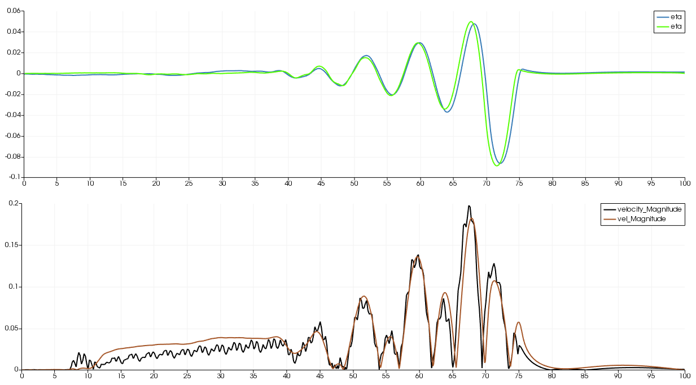

## Moving pressure field and Gradient MLS development

### Attempting
- Add moving pressure to simulate ship-generated waves
- Calculating the gradient of quantities using mesh-free techniques
- Optimised neighbour search algorithm using FEM link table for any radius

### List of Work
- [x] Probes - nearest point
- [ ] Moving Press - Press2 - Press val at linear nodes
- [x] Moving Press - Press2 - Press val at quad nodes
- [ ] Moving Press - Press1 - Press val at linear nodes
- [x] Moving Press - Press1 - Press val at quad nodes
- [ ] waveInputFile search to binary instead of sequential
- [ ] Check soliton generation in /-\\
- [ ] Verify point to point with Ertekin (1986)
- [ ] Neigh search - immediate FEM linktable only
- [x] Neigh search - using FEM linktable for any radius
- [x] Gradient calculation using MLS
- [ ] Gradient calculation using Least-square method
- [ ] Check if stress based approach for second gradient is useful
- [x] Calculate ship wave-making resistance.
- [x] IMPORTANT-BUG : dirichlet BC PQ
- [x] IMPORTANT-BUG : fem_N6i_Sc6_dN6jdx

### IMPORTANT BUG : fem_N6i_Sc6_dN6jdx [2020-03-02]
- In the subroutine _fem_N6i_Sc6_dN6jdx_, I was defining a matrix mat(6,6), but in the declaration I gave mat(6,3)
- This subroutine is only used for pressure Gx, Gy calculations.
- ifort did not show this as error and hopefull calculted the full (6,6) matrix
- gfortran shows this bug (gfortran rockz!)
- Small change in OMP syntax for solveAll PQ. Was only a nextline issue between ifort and gfortran. Shouldnt make diff in results.
- Results
	- Verified rect2D
		- ifort to ifort(d97a4e) comparison exactly same
		- gfortran to ifort(d97a4e) there is tiny difference in near the waveInlet for a short distance. That's probably just a compiler related thing.
	- Verified erB_F1p10_T0p30_B4p0_W08p0_dt0400_gf
		- gfort(new) to ifort(old) comparison is exact
		- ifort(new) to ifort(old) comparison is exact
		- ifort seems to be 1.09x faster than gfortran
	- Hence the bug fix is concluded.
- Similar mistake was made in _mls2DDxSAThesis_. Maybe that's the reason behing the code failing with that subroutine, but I have just commented that subroutine as _mls2DDx_ is working perfectly well.

### IMPORTANT BUG : dirichletBC [2020-02-03]
- In the functions _diriBCPQ_ and _diriBCPQDiff_, I had made the stupid mistake of using i1 and j2 instead of i2 and j2. 
- Due to this the normal velocity was not being made = 0 on the 'slip wall' BC
- Corrected and verified.

### Observations : gradMLS : MLS with FEM Neigh only [2020-01-30]
File : modsMFree.f90
- The derivation in my MTech thesis is based on the thought that the MLS derivation is basically the summation form of the RKPM formulation (which is integral).
- However on rechecking in the book Liu (2005), it seems that's not correct
- **Maybe this is why my DDP code didnt work**
- I have modified the MLS interpolation and MLS derivative calculation as the Liu (2005) book. Its not that difficult as I had thought. 
- It has been verified using the _testMls2DDx_ in the code file.
- The gradient is very poor for incomplete domain.
- Currently the neightbours were based on immediate FEM neighbous. Though seems to be ok but its not perfect, especially near the corners.

#### Update [2020-02-03]
- I had made the stupid mistake of assuming that product of two symmetric matrices is symmetric. This is incorrect and was the reason behind the wrong derivative calculations
- The MLS derivative calculations now are excellent. They have been verified for cases rect2D, fberk and ert. 
- The following folder contains the first derivative of eta plotted and compared against the gradient calculation within paraview for the cases rect2D, fberk and ert
Folder : Output_bsnqM_v1.01_RK4/Output_mlsDx
Paraview : Output_bsnqM_v1.01_RK4/plotAll.pvsm
- MLS gradient even works well now for partial subdomains, as tested in the function _test2DDx_

#### Update : Neigh search - any rad FEM linktable [2020-02-27]
- The radius is calculated using the maximum distance of a node in the immdiate FEM linktable for the node (rmax). The coef is an option to modify the radius as required. _findRadLinkList_
	rad = rmax x coef
- This approach allows automatic adaption to irregular mesh.
- The search for the neighbours is then done for the above calculated radius using the FEM linktable. _findNeiLinkList_
- The bsnq module function _setMFree_ then using the above two subroutines along with _mls2DDx_ and the meshFreeMod function _setPoi_ to initalise the neid, phi, phiDx and phiDy variables for the required nodes.
- For now I have done it for linear nodes, but the neighs are all the points (linear + quad). This ensures enough neighs for each point. **Hence ensure using values at all all points (lin + quad) and not just lin points for gradient and interpolation calculations**.
- The _setMFree_ subroutine is very fast despite doing everything for finding radius, finding neighbours, calculating mls phi and grad, and initialising the mfree point (memory allocation involved). For lin nodes (with lin+quad nodes neighs) it takes about 0.5 x the time taken by subroutine _statMatrices_
- Only if the subroutine _setMFree_ will it allocate the matrix of objects of typ _mfPoiTyp_. Therefore I have ensure that in _outputXML_ gradEta will be output directly if _setMFree_ is called, otherwise it will automatically not call the part calculating gradEta.
- I have removed the _mfFEMTyp_ and he associated _calcAll_ subroutine. This was a badly written code where the neigs were only the immediate FEM neighs and it wasn't very generalisable. It was also very confusing. 
- Added the variable bsnqId to the typ _mfPoiTyp_. This will be set = 0 if the mf point is not a bsnq FEM point, otherwise it will be set as the node Id of that point from the mesh. This will allow easier reference in case only a few bsnq nodes are used as mfPoi instead of all.

### Observations : shipPress : Soliton generation
- Check the paper Ertekin (1986) for required conditions for generation of soliton for Frh>1 for the specific case.
- We seem to be getting similar trends, however I have not compared point to point
- The rate of soliton generation seems to depend on draft, beam, speed, channel width, bathymetry and probably more.
- Check the paper Jian (2002). It says that solitons not generated for non-rectangular bathymetry, even with fully reflecting wall BC.
- So the above comment says |\_| channel will give soliton, whereas \\\_/ does not generate soliton. Although I think /-\\ may generate a soliton.

### Observations : shipPress : Press2 val Linear nodes
This version in arounf 6.5 times faster than the previous code. This code took 23 minutes to run a 25 sec simulation case for domain 100m x 43m, water depth 2.5 constant. Ship moving at Froude = 0.7 along the midline. The earlier code took 160 minutes for the same test case.

### Observations : shipPress : Noise compared to old code

   

**Fig :** Comparison of the current code results with the bsnq_v7.3.3

The comparison of pressure filed moving at Fr=0.7, dont with the old code.  
Old Code : bsnq_v7.3.3  
Location : Tallin/Trial_inl/inl2_v7.3.3CC_C12_Rs15_v0p7  

- It can be seen that the velocity has significantly lesser noise. This is the reason behind the faster (6 times) execution of the code.
- This indicates an increased stability in the code. I am not sure why the code is more stable now. 
- The same level of stability is observed with AdBaE3 time-stepping and RK4 time stepping. So the increase stability is not due to time-stepping
- One possible reason is because I have done the equivalent of h2 = &Psi;i hi2, instead of doing h2 = (&Psi;i hi)2 everywhere. Similar was mentioned in the ADCIRC manual at one place in the square computation.
- The other possibility is the inclusion of the boundary integrals implicitly, however thats not likely because atleast this problem is not boundary driven (I think).
- Another possibility is the inclusion of u on 6 points instead of 3 points in the convective term.
- **Anyway with this increased stability maybe we will finally be able to make the wave-breaking and run-up algorithms work correctly finally.**

### Observations : shipPress : Pressure at lin vs quad nods
It appears that the quad nodes gives slightly better results with the deepest pressure value better represented

-----------------------------------------------

## References
1. Ertekin, R. C., W. C. Webster, and J. V. Wehausen. 1986. “Waves Caused by a Moving Disturbance in a Shallow Channel of Finite Width.” Journal of Fluid Mechanics 169 (August): 275–292. doi:10.1017/S0022112086000630. <http://www.journals.cambridge.org/abstract_S0022112086000630>

1. Jiang, Tao, Rupert Henn, and S D Sharma. 2002. “Wash Waves Generated by Ships Moving on Fairways of Varying Topography.” 24th Symposium on Naval Hydrodynamics 2 (July): 8–13. [Link](https://www.dst-org.de/wp-content/uploads/2016/01/Jiang-Henn-Prof.-Sharma-Wash-Waves-Generated-by-Ships-Moving-on-Fairways-of-Varying-Topography.pdf)

1. Liu, G.R., and Y.T. Gu. 2005. An Introduction to Meshfree Methods and Their Programming. An Introduction to Meshfree Methods and Their Programming. Berlin/Heidelberg: Springer-Verlag. doi:10.1007/1-4020-3468-7.