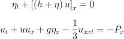

# Develpoment log for bsnqM

## Versions bsnqM_v1.xx.xx

**Details**  
continued from bsnq\_par\_v8.36

- Quad Jacobian = Linear Jacobian for Triangle
- Analytical Integration
- Object Oriented Programming
- Predictor Corrector Time-stepping

-----------------------------------------------

### v1.01

#### Attempting
- Making the code modular so that it can be used by many
- bsnqModule with all the required variables
- It is also required to make it easier to couple with other codes, especially such as MLPG\_R code.
- FEM analytical integrals as general functions so that they can be used later in other code. Check file *femAnalyticalTri_vx.x.f90*

#### List of Work
- [x] Mesh input (Type0)
- [x] FEM Initialisations
- [ ] Wave probes
- [x] Inlet wave characteristics
- [x] Absorbance coeffs
- [ ] Porosity initialisation
- [x] Mass matrices
- [x] Stationary matrix set 1
- [x] Dynamic matrix set 1
- [x] Boundary integrals
- [x] Full momentum mass matrix
- [x] Dirichlet BC
- [x] Conversion to CSR form
- [ ] Neumann BC for eta
- [ ] Time-stepping : Try Adam-bashforth first
- [x] Time-stepping : Predictor Corrector
- [ ] Time-stepping : RK2
- [ ] Bottom shear 
- [ ] Porosity drag terms
- [x] WaveType class with constructor for waveLength
- [x] Paraview XML output

#### Matrices with correct signs
- [x] Mass M1 and M2
- [x] Bs1, Bs2, Bs3, Bs4
- [x] CxF, CyF
- [x] DMat with porosity removed
- [x] Bs5, Bs6
- [x] Advection matrix with porosity removed
- [x] Hydrostatic pressure matrix

#### Modular structure
- bsnqModule
  - type :: bsnqCase
    - procedure ::  initMat
    - procedure ::  meshRead
    - procedure ::  femInit
    - procedure ::  setRun
    - procedure ::  statMatrices
    - procedure ::  dynaMatrices
    - procedure ::  destructR1
  - type :: waveType
    - constructor :: waveLenCalc
- bsnqGlobVars  
  - Datatypes and constants only

#### Observations : Time-stepping : Predictor-Corrector
The predictor-corrector time-stepping had working in the GWCE (Generalised Wave Continuity) equation model pretty well as shown in Dresback(2004). We ourselves had found good results with this time-stepping in our 9-noded FEM-GWCE model, where the oscillations at lower depth and near boundaries were removed. With those results in mind, I tried to implement the algorithm in Bsnq equation. 

  

We first tested it in one-dimension with a simple Bsnq 1D equation as shown above. This was tested in a MATLAB code and found to work well for pressure source with both predictor-corrector and 3-point explicit Adam-Bashforth time-steppings. We were able to get the leading waves in case of pressure disturbances like in the paper Lee (1989). Therefore, based on this we hoped that it might give us the proper ship-generated wave pattern in 2D Bsnq too.

I wrote the code *bsnqM_v1.0.f90* under the *predCor* branch of GitHub repo <https://github.com/shagun1994/bsnq.git>. Its a stripped down code with only basic terms without any dissipation terms or extra source terms, However when I tested it for basic test case suchj as Whalin shoal, it gave me higher than usual wave-amplitudes. Even worse is that there was noise build-up over time and the code failed. Similar observation was notices for constant basthymetry cases too, for kh=0.73, 0.63 and 0.46. Check folder *Trial 21/Output_PredCor_bsnqM_v1.01/* for these results. I even tried to do multiple corrector steps but that just dampened the entire solution.

All the derivations for this are available in the notebook I bought in UK.

There I can conclude that either I didnt apply predictor-corrector properly (unlikely) or the method does not work for this equation (probable). I will try RK2 and RK4. Lets hope that works better than this.

-----------------------------------------------

### References
1. Sørensen, O. R., Schäffer, H. A., & Sørensen, L. S. (2004). Boussinesq-type modelling using an unstructured finite element technique. Coastal Engineering, 50(4), 181–198. [DOI](https://doi.org/10.1016/j.coastaleng.2003.10.005)

1. Agarwal, S., Sriram, V., & Murali, K. (2019). Modelling Wave Interaction with Porous Structures Using Boussinesq Equations. In Proceedings of the Fourth International Conference in Ocean Engineering (ICOE2018) (pp. 573–583). <https://doi.org/10.1007/978-981-13-3119-0_35>

1. Dresback, K. M., Kolar, R. L., & Dietrich, J. C. (2004). A 2D implicit time-marching algorithm for shallow water models based on the generalized wave continuity equation. International Journal for Numerical Methods in Fluids, 45(3), 253–274. https://doi.org/10.1002/fld.697

1. Lee, S.-J., Yates, G. T., & Wu, T. Y. (1989). Experiments and analyses of upstream-advancing solitary waves generated by moving disturbances. Journal of Fluid Mechanics, 199(1), 569. https://doi.org/10.1017/S0022112089000492

